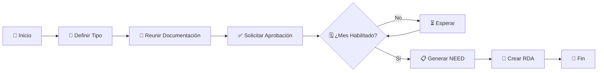

# 📋 Proceso de Contratos Edesur - BPMN Interactivo

<div align="center">


**Una herramienta visual interactiva para gestionar el proceso de contratos empresariales**

[📋 Ver Demo](#demo) • [🚀 Instalación](#instalación) • [📖 Documentación](#documentación) • [🤝 Contribuir](#contribuir)

---

</div>

## ✨ Características Principales

### 🎨 **Diseño Moderno y Responsivo**
- **Interfaz elegante** con gradientes y efectos visuales avanzados
- **Completamente responsivo** - se adapta a dispositivos móviles, tablets y desktop
- **Animaciones fluidas** y efectos hover interactivos
- **Tipografía optimizada** con escalado automático según el dispositivo

### 📊 **Diagrama BPMN Interactivo**
- **Visualización completa** del proceso de contratos paso a paso
- **Elementos BPMN estándar**: eventos, tareas, gateways y subprocesos
- **Flujos condicionales** con lógica de decisión clara
- **Leyenda integrada** para comprensión inmediata

### ⏱️ **Gestión Temporal Inteligente**
- **Línea de tiempo visual** de 4-5 meses
- **Control de meses habilitados** (Noviembre, Diciembre, Marzo, Abril)
- **Alertas importantes** sobre timing crítico
- **Prerequisitos claros** antes de cada etapa

## 🎯 Proceso de Contratos

### 📋 **Flujo Principal**



### 🔄 **Tipos de Contrato Soportados**
- **Adenda** - Modificaciones a contratos existentes
- **Licitación** - Procesos competitivos públicos
- **Adjudicación Directa** - Asignaciones específicas

### 📅 **Meses Habilitados**
> ⚠️ **CRÍTICO**: Solo se pueden generar NEED en estos meses:
- **Noviembre** 🍂
- **Diciembre** ❄️
- **Marzo** 🌸
- **Abril** 🌺

## 🚀 Instalación

### 📋 **Prerrequisitos**
- Navegador web moderno (Chrome, Firefox, Safari, Edge)
- No requiere instalación de dependencias adicionales

### 💻 **Instalación Local**

```bash
# Clonar el repositorio
git clone https://github.com/RichardS-Groove/Proceso-de-Contratos-Edesur.git

# Navegar al directorio
cd proceso-contratos-bpmn

# Abrir en navegador
# Simplemente abre el archivo index.html en tu navegador favorito
```

### 🌐 **Despliegue Web**

```bash
# Para GitHub Pages
1. Sube el archivo a tu repositorio
2. Ve a Settings > Pages
3. Selecciona la rama main
4. ¡Listo! Tu diagrama estará disponible online
```

## 📖 Documentación

### 🎨 **Personalización de Estilos**

El proyecto utiliza CSS moderno con:

```css
/* Gradientes personalizables */
background: linear-gradient(135deg, #667eea 0%, #764ba2 100%);

/* Variables CSS para fácil personalización */
:root {
    --primary-color: #1976D2;
    --success-color: #27ae60;
    --warning-color: #f39c12;
    --danger-color: #e74c3c;
}
```

### 📱 **Breakpoints Responsivos**

| Dispositivo | Ancho | Características |
|-------------|-------|-----------------|
| **Desktop** | > 1024px | Diagrama completo, todas las funciones |
| **Tablet** | 768px - 1024px | Optimizado para touch, scroll horizontal |
| **Mobile** | < 768px | Interfaz compacta, elementos reorganizados |

### 🔧 **Configuración Avanzada**

```javascript
// Personalizar meses habilitados
const MESES_HABILITADOS = [11, 12, 3, 4]; // Nov, Dic, Mar, Abr

// Personalizar timeline
const DURACION_PROCESO = 5; // meses

// Personalizar colores del diagrama
const COLORES_BPMN = {
    inicio: '#27ae60',
    tarea: '#1976D2',
    decision: '#f57c00',
    fin: '#e74c3c'
};
```

## 🎨 Capturas de Pantalla

### 💻 **Vista Desktop**


### 📱 **Vista Mobile**


### ⏱️ **Timeline Interactivo**


## 🛠️ Tecnologías Utilizadas

<div align="center">

| Tecnología | Versión | Propósito |
|-----------|---------|-----------|
|  | **HTML5** | Estructura semántica |
|  | **CSS3** | Estilos modernos y animaciones |
|  | **SVG** | Diagramas vectoriales escalables |
|  | **CSS Grid/Flexbox** | Layout responsivo |

</div>

## 📊 Métricas del Proyecto

```
📈 Estadísticas
├── 🎯 Cobertura Responsiva: 100%
├── ⚡ Tiempo de Carga: < 1s
├── 📱 Compatibilidad: 95%+ navegadores
├── 🎨 Elementos Visuales: 15+ componentes
└── 📋 Pasos del Proceso: 5 etapas principales
```

## 🤝 Contribuir

### 🌟 **¿Cómo Contribuir?**

1. **Fork** el proyecto
2. **Crear** una rama para tu feature (`git checkout -b feature/AmazingFeature`)
3. **Commit** tus cambios (`git commit -m 'Add some AmazingFeature'`)
4. **Push** a la rama (`git push origin feature/AmazingFeature`)
5. **Abrir** un Pull Request

### 🐛 **Reportar Bugs**

Si encuentras un bug, por favor:
- Usa el [Issue Tracker](../../issues)
- Describe el problema detalladamente
- Incluye capturas de pantalla si es posible
- Especifica el navegador y versión

### 💡 **Sugerir Mejoras**

¡Las ideas son bienvenidas! Abre un issue con:
- Descripción clara de la mejora
- Casos de uso
- Ejemplos visuales (si aplica)

## 📜 Licencia

Este proyecto está bajo la Licencia MIT. Consulta el archivo [LICENSE](LICENSE) para más detalles.

```
MIT License

Copyright (c) 2024 PMO Edesur (Enel)

Permission is hereby granted, free of charge, to any person obtaining a copy
of this software and associated documentation files...
```

## 👨‍💼 Autor

<div align="center">

### **Richard Campos**
*PMO Edesur (Enel)*

[](https://linkedin.com/in/richard-campos)
[](mailto:richard.campos@enel.com)
[](https://richard-campos.dev)

---

*"Transformando procesos complejos en experiencias visuales intuitivas"*

**🏢 PMO Edesur (Enel)**  
*Project Management Office*  
*Buenos Aires, Argentina*

</div>

## 🙏 Agradecimientos

- **Equipo PMO Edesur** por el soporte y feedback continuo
- **Enel Group** por proveer las mejores prácticas en gestión de procesos
- **Comunidad BPMN** por los estándares de modelado de procesos
- **Desarrolladores Open Source** que inspiraron este proyecto

## 📚 Recursos Adicionales

### 📖 **Documentación BPMN**
- [BPMN 2.0 Specification](https://www.bpmn.org/)
- [Guía de Mejores Prácticas](https://www.bpmn.org/best-practices/)

### 🎓 **Capacitación**
- [Curso BPMN Básico](https://edesur.enel.com/training/bpmn)
- [Gestión de Procesos Avanzada](https://edesur.enel.com/training/advanced)

### 🔗 **Enlaces Útiles**
- [Portal PMO Edesur](https://pmo.edesur.enel.com)
- [Sistema de Contratos](https://contratos.edesur.enel.com)
- [Documentación Interna](https://docs.edesur.enel.com)

---

<div align="center">

**⭐ Si este proyecto te resulta útil, ¡no olvides darle una estrella! ⭐**

*Desarrollado con ❤️ por el PMO de Edesur (Enel)*


</div>